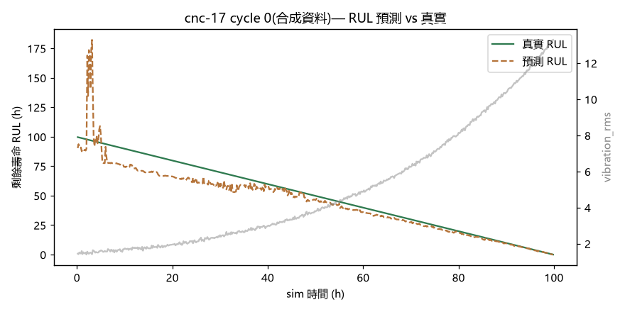

# 資料可訓練性實證 — 基準 ML 範例

> 回答一個關鍵問題:**「這套平台產生的合成資料,學生真的訓練得出有用的模型嗎?」**
> 答案:**會**。下面是一個誠實設定下、可重現的基準結果。

## 怎麼跑

```powershell
# 1) 產帶標籤的資料(各設備多次 run-to-failure 循環)
.\.venv\Scripts\python.exe tools\generate_dataset.py --sim-days 120 --step-min 10 --out dataset

# 2) 裝 ML 相依(非引擎相依,裝同一個 venv)
.\.venv\Scripts\python.exe -m pip install -r student_kit\requirements-ml.txt

# 3) 訓練 + 評估(預設拿 CNC 群;可換 --pattern "wt-*.csv" 等)
.\.venv\Scripts\python.exe student_kit\p4_train_baseline.py --pattern "cnc-*.csv"
```

## 誠實的評估設定(避免灌水)

- **特徵只用學生看得到的觀測訊號**(振動 / 電流 / 溫度 / 工具磨耗…),**完全不碰 ground-truth**(health / RUL)。
- **滾動特徵(mean / std / slope)在每個 run-to-failure 循環內計算** → 不跨循環洩漏。
- **train / test 依「機台」切**:測試的 7 台 CNC(cnc-17…cnc-23)**訓練時完全沒看過** →
  驗證能不能類推到沒看過的同型設備,而不是死記。

## 結果(23 台 CNC,16 訓練 / 7 held-out)

| 任務 Task | 指標 Metric | 結果 | 基準 Baseline |
|---|---|---|---|
| 故障分類 `fail_within_24h` | F1 / ROC-AUC | **0.951 / 0.998** | 多數類 acc 0.762 |
| | precision / recall | 0.924 / 0.979 | — |
| RUL 迴歸 `ttf`(剩餘壽命,小時) | MAE / RMSE / R² | **5.5 h / 10.5 h / 0.935** | 只猜平均 RMSE 41 h |
| 提前量 Lead time | 中位 / p25 | **24.4 h / 23.3 h** | — |

**模型 top 特徵**:`vibration_rms`、`vibration_rms_rmean`、`spindle_temp`、`coolant_temp` ——
正是訊號模型裡刻意設計的「振動領先、溫度跟隨」退化主軸。**模型學到的是對的物理線索,不是假相關。**



> 圖:某 held-out 機台一個循環。綠=真實 RUL、橘=預測 RUL、灰=振動。
> 隨著振動爬升(接近故障),預測 RUL 收斂到真實值;早期健康時預測較不準 —— 這是誠實的
> (還沒壞時本來就沒什麼訊號可預測),不是 bug。

## 怎麼解讀(給課程設計)

- **學得起來**:資料是一個有 latent 健康狀態的生成模型,觀測訊號是健康的函數且彼此相關、帶雜訊、
  每筆有 ground-truth 標籤 —— 因此分類 / RUL 迴歸 / 異常偵測都有可學的映射。上面數字就是證據。
- **這只是基準,不是天花板**:學生可換更好的特徵(頻域、循環內趨勢)、更好的模型(GBT、LSTM、survival),
  或直接打 `/api/predictions` 做**閉環即時預測**比 lead time。`p4_train_baseline.py` 是可改的起點。
- **⚠ 合成資料的誠實定位**:模型學的是「**我們假設的退化物理**」,**適合教 ML 工作流程**(特徵工程、
  防洩漏切分、評估、閉環),**但不保證直接遷移到真實設備**(domain gap)。資料全程標示 synthetic。

## 檔案

- [student_kit/p4_train_baseline.py](../student_kit/p4_train_baseline.py) — 訓練 + 評估腳本(可改的起點)
- [student_kit/requirements-ml.txt](../student_kit/requirements-ml.txt) — ML 相依
- `dataset/baseline_report.json` — 完整指標(本檔旁 `ML_baseline_report.json` 為當次存證)
