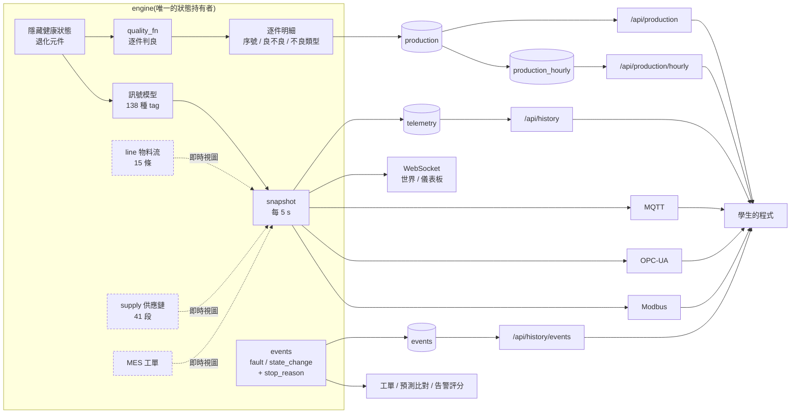

# 資料盤點:這座園區產得出「生產數據」嗎?

> 盤點日期 2026-08-22(**A + B 兩批機型補完後重測**)· 對象 `scenarios/class_park.yaml`
> (73 廠 / 185 台 / 25 機型)。上一版是 2026-08-21 的 69 廠 / 165 台 / 15 機型;
> 下面凡是寫「補完前」的比較基準都是那一版。
> 數字全部由 `python tools/audit_data_coverage.py` 實測產生 —— 改了引擎要回頭重跑對數,不要手寫覆蓋率。
> 本檔回答一個問題:**課程要教「雲端生產數據」,這座園區現在吐得出來的資料夠不夠用?**

## 一句話結論

盤點當下:**訊號層很完整,資料層不完整** —— 165 台每 5 秒吐 1872 個數值點、三協定都讀得到、
歷史撈得回來;但「一件產品從投料到出貨發生過什麼」只存在於引擎的即時視圖,沒有落地成可查詢的資料。
學生能做「這台設備的振動趨勢」,做不了「上週這條線為什麼少出 200 件」。

**P1 補完後(2026-08-21)**:停機原因碼、事件表、逐件生產紀錄與良/不良計數都進來了,
每份 snapshot 從 1872 → **2255** 個數值點,品質訊號從 39 → **79 台**、狀態域 **165/165 台**。
上面那三題現在都是一句 SQL。詳見文末〈P1 補完了什麼〉。

**機型補完後(2026-08-22)**:鑄造 / 鍛造上游 5 種與手工具後段 5 種上線,園區成長為
**73 廠 / 185 台 / 25 機型**,每份 snapshot **2612** 個數值點(不重複 tag 219 支),
廣播間隔 5 s → historian 約 522 列/秒。新增的 10 種機型六個資料域幾乎全齊 ——
新機型一律走完整垂直切片,不留只有殼的機器。

---

## 資料是怎麼流的(現況)



現在還是虛線的只剩三處:**物料流、供應鏈、工單只有「當下」,沒有歷史**(P2/P3 處理)。


---

## 訊號層:逐機型覆蓋(實測)

| 機型 | 台 | 產出計數 | 節拍 | 品質 | 能耗 | 狀態 | 劣化徵兆 |
|---|---:|:--:|:--:|:--:|:--:|:--:|:--:|
| cnc_machining_center | 31 | ✔ | ✔ | **✔ P1** | ✔ | ✔ | ✔ |
| robot_arm_6axis | 28 | ✔ | — | — | ✔ | ✔ | ✔ |
| conveyor | 27 | — | ✔ | — | ✔ | ✔ | ✔ |
| energy_meter | 20 | — | — | — | ✔ | ✔ | — |
| semi_process_chamber | 14 | ✔ | — | ✔ | ✔ | ✔ | ✔ |
| air_compressor | 10 | — | — | — | ✔ | ✔ | ✔ |
| heat_treat_furnace | 10 | — | — | ✔ | ✔ | ✔ | ✔ |
| stamping_press | 10 | ✔ | ✔ | ✔ | ✔ | ✔ | ✔ |
| injection_molding | 9 | ✔ | ✔ | **✔ P1** | — | ✔ | ✔ |
| agv_mobile_robot | 6 | — | ✔ | — | ✔ | ✔ | ✔ |
| wind_turbine | 5 | — | ✔ | — | ✔ | ✔ | ✔ |
| packaging_machine | 2 | ✔ | ✔ | ✔ | ✔ | ✔ | ✔ |
| aoi_inspection | 1 | ✔ | ✔ | ✔ | — | ✔ | ✔ |
| laser_cutter | 1 | ✔ | ✔ | ✔ | ✔ | ✔ | ✔ |
| welding_cell | 1 | ✔ | ✔ | ✔ | ✔ | ✔ | ✔ |
| melting_furnace | 1 | ✔ | ✔ | ✔ | ✔ | ✔ | ✔ |
| die_casting_machine | 1 | ✔ | ✔ | ✔ | — | ✔ | ✔ |
| induction_heater | 1 | ✔ | — | ✔ | ✔ | ✔ | ✔ |
| forging_press | 1 | ✔ | ✔ | ✔ | — | ✔ | ✔ |
| trimming_press | 1 | ✔ | ✔ | ✔ | ✔ | ✔ | ✔ |
| grinding_polisher | 1 | ✔ | ✔ | ✔ | ✔ | ✔ | ✔ |
| cleaning_dryer | 1 | ✔ | ✔ | ✔ | ✔ | ✔ | ✔ |
| plating_line | 1 | ✔ | ✔ | ✔ | ✔ | ✔ | ✔ |
| assembly_station | 1 | ✔ | ✔ | ✔ | ✔ | ✔ | ✔ |
| torque_tester | 1 | ✔ | ✔ | ✔ | ✔ | ✔ | ✔ |

覆蓋率(A + B 兩批機型補完後,25 機型 / 185 台):

| 資料域 | 機型覆蓋 | 台數覆蓋 | 還缺誰 |
|---|---:|---:|---|
| 狀態 | 25/25 | **185/185** | — |
| 能耗 | 21/25 | 173/185 | aoi、壓鑄、鍛造、射出 |
| 劣化徵兆 | 24/25 | 165/185 | energy_meter(它本來就是量別人的) |
| 產出計數 | 19/25 | 107/185 | 手臂以外的搬運與廠務類 |
| 節拍 / 速率 | 19/25 | 102/185 | 廠務類 + 感應加熱 / 腔體 / 手臂 |
| 品質 | 19/25 | **89/185** | 搬運與廠務類(它們本來就不判良) |

上一版(15 機型 / 165 台)是:狀態 165/165、能耗 155/165、劣化徵兆 145/165、
產出計數 89/165、品質 79/165。**新增的 10 種機型每一種六個資料域幾乎全齊** ——
這是刻意的:新機型一律走完整垂直切片,不留只有殼的機器。

還沒補齊的格子多半是**本來就不該有**的(輸送帶不判良、電表不會自己劣化),
真正的缺口只有四台的能耗訊號(aoi / 壓鑄 / 鍛造 / 射出)。

**補完前最刺眼的一格**:園區裡最多的 CNC(31 台)與射出成型(9 台)沒有任何品質訊號 ——
CNC 只有 `tool_wear`(那是設備狀態,不是產品品質),射出只有製程參數。
現在 CNC 有 `dimension_deviation` / `surface_roughness`、射出有 `short_shot_rate` /
`part_weight_deviation`,加上每台 producer 共通的 `good_count` / `reject_count`。
仍然沒有品質訊號的是**本來就不產出東西的設備**(手臂 / 輸送帶 / AGV / 空壓機 / 電表 / 風機),那是對的。

---

## 資料層:十個資料域的有無

| 資料域 | 現況 | 學生實際拿得到什麼 |
|---|:--:|---|
| 即時訊號(SCADA 面) | ✔ | 三協定 + WS,131 種 tag,5 s 一次 |
| 時序歷史(Historian) | ✔ | `telemetry(wall_t, sim_t, device_id, tag, value)`,14 天保留,約 32 M 列/天 |
| 設備狀態序列 | ✔ | `state` 是數值 tag(0 idle / 1 running / 3 alarm / 4 fault / 5 maintenance…),歷史撈得到 |
| 停機**原因** | ✅ P1 | `stop_reason_code` tag(每台都有,9 種碼)+ 事件表的 `stop_reason` 欄。故障仍只給「進了 fault」,元件名是 ground-truth 不外流 |
| 事件紀錄(alarm / fault) | ✅ P1 | `events` 表 + `GET /api/history/events`(可依設備 / 公司 / 型別 / 停機原因篩)|
| 品質結果 | ✅ P1 | 每台 producer 都有 `good_count` / `reject_count`(**產出 = 良 + 不良**,CI 守著);CNC 補 `dimension_deviation` / `surface_roughness`,射出補 `short_shot_rate` / `part_weight_deviation` |
| 逐件生產紀錄 | ✅ P1 | `production` 表:序號 / 設備 / 時間 / 良不良 / 不良類型 / 工單,`GET /api/production`。序號**不進 Modbus**(真工廠的序號在 MES 不在 PLC)|
| 工單歷史 | ◐ | `/api/orders` 給當下工單 + **每台最近 8 張**完工單(`engine/mes.py` 的環狀緩衝);再往前的單就沒了,一學期的準交率趨勢做不出來 |
| 物料流 / 供應鏈歷史 | ✘ | `lines` / `supply` 是即時視圖(緩衝、在手、缺料),**上一小時長什麼樣查不到** |
| 能耗歸屬 | ◐ | 20 台電表有 kWh,但電表**沒有對應到設備或產線**,單位產品能耗算不出來 |

補充兩點現況觀察(不是缺陷,是教學設計要決定的事):

- **OEE 是平台直接給的。** `/api/oee` 公開回傳 availability / performance / quality,三個數都由引擎從
  ground-truth 累積。學生不需要自己從資料算 —— 對「資料課」而言,這等於把最核心的一道題先寫好答案了。
- **良率現在算得出來了(P1)。** 可用率從 `state` / `stop_reason_code` 序列推、表現從 `cycle_time`
  與計數推、良率從 `good_count` / `reject_count` 推 —— 學生第一次能自己把 OEE 三要素算完,
  再拿平台的 `/api/oee` 對答案。「自己算」與「平台給」哪個當作業,是教學決定,資料兩邊都備好了。

---

## 缺口 → 學生現在做不出來的題

| 缺口 | 做不出來的題 | 這在真工廠是哪張報表 |
|---|---|---|
| ~~停機原因碼~~ ✅ | 「上週這條線損失的 40 小時,哪一種原因佔最多?」 | 停機 Pareto / 六大損失 |
| ~~事件沒落地~~ ✅ | 「這台設備的 MTBF、MTTR 是多少?」 | 可靠度報表 |
| ~~沒有良/不良計數~~ ✅ | 「良率跟哪個製程參數相關?」「首件不良發生在什麼條件下?」 | SPC / 良率分析 |
| ~~沒有逐件紀錄~~ ✅ | 「這件不良品是哪台機、哪個時段、用哪批料做的?」 | 追溯 / 系譜(genealogy) |
| 物料流無歷史 | 「昨天 WIP 為什麼堆到 30 件?瓶頸何時開始移動?」 | WIP 曲線 / 瓶頸分析 |
| 供應鏈無歷史 | 「上游停 2 小時,下游幾點開始餓料、少出多少?」 | 供應中斷影響分析 |
| 能耗未歸屬 | 「每做一件產品耗多少電?哪條線最耗能?」 | 能源 KPI / 碳盤查 |
| ~~查詢介面~~ ✅ | 「一次撈 3 台 × 10 個 tag × 一週,做相關分析」 | 資料湖 / BI 取數 |

最後一項展開講(**已於 2026-08-22 的 P2 補完,見下節**):`/api/history` 先前一次只能查
**一台設備的一支 tag**(上限 5 萬列,無降採樣、無 CSV)。要做一條產線的跨設備相關分析,
學生得打幾十次 API 再自己對齊時間戳 —— 這正是 `api/submissions.py` 的 correlation
批改先前踩過的坑(已改成對 `sim_t` 對齊)。對一門「雲端生產數據」課程來說,
**取數這一段本身就是教材**,值得做像樣一點。

---

## 建議的補完順序

### ✅ P1 · 資料鏈落地(2026-08-21 完成)

三件互相咬合的事一次做完(分開做會做兩次,而且做完任何一件單獨都還是算不出 OEE):
停機原因碼、事件表落地、逐件生產紀錄與良/不良計數。做法與驗證見下一節。

### ✅ P2 · 取數介面升級(2026-08-22 完成)

兩條路都做了:REST 強化為主、唯讀 SQL 給進階。

**`/api/history` 升級**(舊呼叫 `?device=&tag=` **零回歸**,形狀與欄位名一個字沒變):

| 參數 | 作用 |
|---|---|
| `devices=` / `tags=` | 逗號分隔,多設備 × 多 tag 一次撈 |
| `bucket=` | 時間桶秒數(常用 1 / 60 / 3600),吐 **avg / min / max / count** |
| `shape=` | `wide`(預設,時間已對齊,直接進 pandas)/ `long` |
| `agg=` | wide + bucket 時每格放哪個統計量(wide 是二維表,一格只放得下一個) |
| `format=csv` | 兩種形狀都能匯出(帶 UTF-8 BOM,Excel 開中文不亂碼) |

三個值得記住的設計點:

- **降採樣吐四個統計量,不是只有 avg**。預測性維護看的是**峰值** —— 振動尖峰、溫度
  突波被 1 小時平均一抹就不見了,而那正是學生要偵測的東西。`count` 讓補值與缺值分得開。
- **時間戳天然對齊**:historian 是對同一份 snapshot 取樣的,一拍裡所有設備共用同一個
  `wall_t`,所以多設備的原始點本來就並排得起來,不必先降採樣。**真工廠的多來源資料
  沒這個性質**,教材要記得講這個差別。
- `limit` 在 wide 是**時間列數**不是長列數;要了卻沒資料的序列會列在 `missing`
  (不是每台都有每支 tag:CNC 是 `spindle_current`、研磨機才是 `motor_current`)。

**唯讀 SQL**(進階):`GET /api/sql?q=`,可查的四張表與範例見 `GET /api/sql/tables`。

> **安全邊界不靠字串比對。** 關鍵字黑名單一定繞得過(註解、大小寫、巢狀),所以真正的
> 防線是**讓資料庫自己拒絕寫入**:sqlite 另開 `mode=ro` 唯讀連線、PG 跑在 READ ONLY
> transaction 裡。語法閘門(只准 SELECT/WITH、一次一句、白名單四張表)是**第二層**,
> 用途是給友善的錯誤訊息與限制範圍。CI 因此會**繞過語法閘門直接請 historian 跑
> DELETE / UPDATE / DROP / INSERT**,四句都必須被資料庫擋下且資料一列沒少。

護欄:一次一句、最多 20000 列、10 秒逾時。降級(in-memory)模式會誠實拒絕並指路回
`/api/history`,不假裝能跑 SQL。四張表都不含 ground-truth —— 健康度與故障元件名
仍然只在教師面。

學生範例:`student_kit/p6_fetch_data.py`(四種取法各一段,可直接執行)。
契約測試:`tests/test_data_access.py`(21 項,進 CI)。

### P3 · 能耗歸屬與廠級彙總

電表 ↔ 設備 / 產線的對應關係進場景(哪幾台掛在哪只表下),讓「單位產品能耗 kWh/件」算得出來;
再往上做廠級 / 園區級的每小時彙總表(產量、能耗、稼動、不良),當作 BI 層的教材。

---

## P1 補完了什麼(2026-08-21)

### 停機原因碼

每台設備多一支 `stop_reason_code`(int16,九種碼:`running` / `off_shift` / `no_order` /
`starved` / `blocked` / `teacher_stop` / `maintenance` / `fault` / `idle_no_work`),
碼表在 `GET /api/catalog` 的 `enums` 區。狀態轉換事件同時帶上 `stop_reason`。

這些狀態引擎**本來就知道**(`line_has_input`、`line_output_blocked`、MES 有無工單、班表、
故障閂鎖),P1 只是把結論說出來 —— 沒有新增任何狀態(鐵則一)。原因碼與實際狀態一致由 CI 守著:
**在動才叫 `running`**,空帶待機的輸送帶會誠實報 `idle_no_work` 而不是混進 `running`。

故障事件只說「這台在這個時間點進了 fault」,**不帶元件名** —— 那是 ground-truth(等於寫著答案),
要查根因仍得走教師面的 `/api/devices/{id}/health`。

### 逐件生產紀錄與良/不良計數

producer 的累積量 tag 每進一位 = 完成一件 → 當場判良/不良 → 產一筆帶序號的明細:

```json
{"serial": "d020#000072", "device_id": "d020", "template": "injection_molding",
 "good": false, "defect": "short_shot", "order_id": "WO-C09-0002", "sim_t": 2212.64}
```

判良的機率取自各 template 的 `quality_fn`,而 `quality_fn` **呼叫的是同一支訊號 driver**
(沖壓用毛邊率、焊接用飛濺率、雷切用掛渣率、包裝用封口不良率…),不是另外亂數;
讀的是由健康度重算的乾淨值,**不吃感測器故障層** —— 感測器壞掉不該讓工件跟著變不良。
沒有明確不良率訊號的機型退回 `oee_fn` 的 quality(良率的 ground-truth 本來就在那裡)。

CNC 與射出補的四支品質訊號各有不同的物理來源,學生才有得判:

| 機型 | 訊號 | 跟著什麼走 | 判不良的規則 |
|---|---|---|---|
| CNC | `dimension_deviation`(µm)| 刀具磨耗 + 主軸熱伸長 | 撞 ±25 µm 公差 |
| CNC | `surface_roughness`(Ra µm)| 振動 + 刀鈍 | 超過 Ra 2.6 |
| 射出 | `short_shot_rate`(%)| 螺桿磨耗(逆止環洩料)+ 料溫偏低 | 短射即不良 |
| 射出 | `part_weight_deviation`(g)| 油壓保壓不穩 | 撞 ±1.5 g 規格 |

兩支一起看才分得出「該換刀」還是「主軸軸承出問題」/「該保養螺桿」還是「油壓保壓出問題」。
健康機台也有 **0.4~0.5% 的隨機不良底線**(素材變異、夾持誤差等未建模的原因)——
真工廠不會有 100.00% 良率,給 0 反而是不誠實的資料。

**工件序號不進 Modbus 點位**(2026-08-21 使用者決定):真工廠的序號在 MES 不在 PLC 暫存器,
而且既有的學生連線程式不必因此改位址。新增的 tag 一律**附加在既有 tag 之後**,
既有位址一格都不動 —— 學生手上照舊位址寫的程式零回歸。

### 三張表與三支 API

| 表 | 內容 | 保留期 | API |
|---|---|---|---|
| `events` | 狀態轉換 / 故障 + 停機原因 | 同 telemetry(14 天)| `GET /api/history/events` |
| `production` | 逐件明細(序號 / 良不良 / 不良類型 / 工單)| **2 天**(`PRODUCTION_RETENTION_DAYS`)| `GET /api/production` |
| `production_hourly` | 每台每小時 × 每種結果的件數 | **永久**(一天才幾千列)| `GET /api/production/hourly` |

明細短期、彙總長期是真 historian 的作法 —— 課堂園區 89 台 producer 在 ×120 下一天上千萬件,
明細留兩天夠做追溯與良率相關,一學期的良率趨勢靠彙總表。彙總是 upsert(同一小時同一台同一種結果
只有一列,件數累加),SQLite 與 TimescaleDB 兩套 schema 都建。

### 現在做得出來的題(先前做不出來)

```sql
-- 停機 Pareto:上週這條線的停機,哪一種原因最多?
SELECT stop_reason, COUNT(*) FROM events
WHERE company_id = 'c05' AND type = 'state_change' GROUP BY stop_reason ORDER BY 2 DESC;

-- 良率趨勢與不良 Pareto(defect = '' 是良品)
SELECT hour_t, defect, SUM(pieces) FROM production_hourly
WHERE device_id = 'd001' GROUP BY hour_t, defect;

-- 追溯:這件不良品是哪台機、什麼時候、哪張工單做的?
SELECT * FROM production WHERE serial = 'd020#000072';
```

MTBF / MTTR 則是對 `events` 算 fault 之間的間隔與 fault→恢復的時間。

### 驗證

`tests/test_production_records.py`(進 CI)守四條線:**產出 = 良品 + 不良品**、
逐件明細筆數與計數器一致、序號唯一、原因碼與實際狀態一致、每小時彙總 = 明細加總,
以及**學生面不得洩 ground-truth**(事件與明細都不含元件名 / 健康度)。
既有 12 支契約測試 + 場景健全性全數維持綠燈。

---

## 怎麼重跑這份盤點

```bash
python tools/audit_data_coverage.py                      # 課堂版(本檔數字來源)
python tools/audit_data_coverage.py scenarios/default_park.yaml
python tools/audit_data_coverage.py --json               # 給其他工具吃
```

工具只讀引擎狀態、不寫檔、不需要活廠。判定用 **tag 名稱關鍵字**分類 —— 因為名稱是學生唯一看得到的線索:
一支訊號若光看名字認不出它屬於哪個資料域,對學生就等於不存在。

---

*本平台所有數據皆為合成資料,帶 ground-truth 標籤供教學與評分使用,非真實場域量測。*
