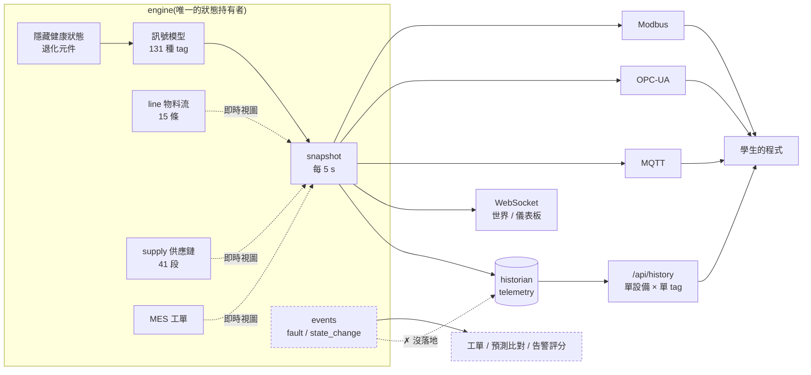

# 資料盤點:這座園區產得出「生產數據」嗎?

> 盤點日期 2026-08-21 · 對象 `scenarios/class_park.yaml`(69 廠 / 165 台 / 15 機型)
> 數字全部由 `python tools/audit_data_coverage.py` 實測產生 —— 改了引擎要回頭重跑對數,不要手寫覆蓋率。
> 本檔回答一個問題:**課程要教「雲端生產數據」,這座園區現在吐得出來的資料夠不夠用?**

## 一句話結論

**訊號層很完整,資料層不完整。** 165 台設備每 5 秒吐 1872 個數值點、三協定都讀得到、歷史撈得回來;
但「一件產品從投料到出貨發生過什麼」這條**資料鏈**目前只存在於引擎的即時視圖裡,沒有落地成可查詢的資料。
學生能做「這台設備的振動趨勢」,做不了「上週這條線為什麼少出 200 件」。

---

## 資料是怎麼流的(現況)



虛線就是缺口所在:**事件、物料流、供應鏈、工單只有「當下」,沒有「歷史」。**

---

## 訊號層:逐機型覆蓋(實測)

| 機型 | 台 | 產出計數 | 節拍 | 品質 | 能耗 | 狀態 | 劣化徵兆 |
|---|---:|:--:|:--:|:--:|:--:|:--:|:--:|
| cnc_machining_center | 31 | ✔ | ✔ | **—** | ✔ | ✔ | ✔ |
| conveyor | 25 | — | ✔ | — | ✔ | ✔ | ✔ |
| robot_arm_6axis | 20 | ✔ | — | — | ✔ | ✔ | ✔ |
| energy_meter | 20 | — | — | — | ✔ | — | — |
| semi_process_chamber | 14 | ✔ | — | ✔ | ✔ | ✔ | ✔ |
| air_compressor | 10 | — | — | — | ✔ | ✔ | ✔ |
| heat_treat_furnace | 10 | — | — | ✔ | ✔ | ✔ | ✔ |
| stamping_press | 10 | ✔ | ✔ | ✔ | ✔ | ✔ | ✔ |
| injection_molding | 9 | ✔ | ✔ | **—** | — | ✔ | ✔ |
| agv_mobile_robot | 6 | — | ✔ | — | ✔ | ✔ | ✔ |
| wind_turbine | 5 | — | ✔ | — | ✔ | ✔ | ✔ |
| packaging_machine | 2 | ✔ | ✔ | ✔ | ✔ | ✔ | ✔ |
| aoi_inspection | 1 | ✔ | ✔ | ✔ | — | ✔ | ✔ |
| laser_cutter | 1 | ✔ | ✔ | ✔ | ✔ | ✔ | ✔ |
| welding_cell | 1 | ✔ | ✔ | ✔ | ✔ | ✔ | ✔ |

覆蓋率:能耗 155/165 台、狀態與劣化徵兆各 145/165 台、產出計數 89/165 台、**品質只有 39/165 台**。

**最刺眼的一格**:園區裡最多的 CNC(31 台)與射出成型(9 台)**沒有任何品質訊號**。
CNC 只有 `tool_wear`(那是設備狀態,不是產品品質),射出只有製程參數。
也就是說,佔全園區 24% 的主力設備,學生拿不到「這批做出來好不好」的資料。

---

## 資料層:十個資料域的有無

| 資料域 | 現況 | 學生實際拿得到什麼 |
|---|:--:|---|
| 即時訊號(SCADA 面) | ✔ | 三協定 + WS,131 種 tag,5 s 一次 |
| 時序歷史(Historian) | ✔ | `telemetry(wall_t, sim_t, device_id, tag, value)`,14 天保留,約 32 M 列/天 |
| 設備狀態序列 | ✔ | `state` 是數值 tag(0 idle / 1 running / 3 alarm / 4 fault / 5 maintenance…),歷史撈得到 |
| 停機**原因** | ✘ | 餓料、滿料、無工單、班外都落成同一個 `idle`;故障只知道 `fault`,不知道哪個元件 |
| 事件紀錄(alarm / fault) | ✘ | 引擎有 `_detect_events()`,但只廣播給工單 / 預測 / 告警評分,**沒寫進 historian** |
| 品質結果 | ◐ | 只有 7 種機型的「率」(reject_rate / burr_rate / particle_count…),**沒有良品 / 不良品計數** |
| 逐件生產紀錄 | ✘ | 產線只記件數(帳),沒有工件 id、批號、經過哪些站、每件花多久 |
| 工單歷史 | ◐ | `/api/orders` 給當下工單 + **每台最近 8 張**完工單(`engine/mes.py` 的環狀緩衝);再往前的單就沒了,一學期的準交率趨勢做不出來 |
| 物料流 / 供應鏈歷史 | ✘ | `lines` / `supply` 是即時視圖(緩衝、在手、缺料),**上一小時長什麼樣查不到** |
| 能耗歸屬 | ◐ | 20 台電表有 kWh,但電表**沒有對應到設備或產線**,單位產品能耗算不出來 |

補充兩點現況觀察(不是缺陷,是教學設計要決定的事):

- **OEE 是平台直接給的。** `/api/oee` 公開回傳 availability / performance / quality,三個數都由引擎從
  ground-truth 累積。學生不需要自己從資料算 —— 對「資料課」而言,這等於把最核心的一道題先寫好答案了。
- **良率無論如何算不出來。** 就算學生想自己算 OEE,可用率能從 `state` 序列推、表現能從 `cycle_time` 與
  計數推,但**良率沒有學生面資料可推**(沒有良/不良計數)。這是上表「品質」與「逐件紀錄」兩個缺口的直接後果。

---

## 缺口 → 學生現在做不出來的題

| 缺口 | 做不出來的題 | 這在真工廠是哪張報表 |
|---|---|---|
| 停機原因碼 | 「上週這條線損失的 40 小時,哪一種原因佔最多?」 | 停機 Pareto / 六大損失 |
| 事件沒落地 | 「這台設備的 MTBF、MTTR 是多少?」 | 可靠度報表 |
| 沒有良/不良計數 | 「良率跟哪個製程參數相關?」「首件不良發生在什麼條件下?」 | SPC / 良率分析 |
| 沒有逐件紀錄 | 「這件不良品是哪台機、哪個時段、用哪批料做的?」 | 追溯 / 系譜(genealogy) |
| 物料流無歷史 | 「昨天 WIP 為什麼堆到 30 件?瓶頸何時開始移動?」 | WIP 曲線 / 瓶頸分析 |
| 供應鏈無歷史 | 「上游停 2 小時,下游幾點開始餓料、少出多少?」 | 供應中斷影響分析 |
| 能耗未歸屬 | 「每做一件產品耗多少電?哪條線最耗能?」 | 能源 KPI / 碳盤查 |
| 查詢介面 | 「一次撈 3 台 × 10 個 tag × 一週,做相關分析」 | 資料湖 / BI 取數 |

最後一項展開講:`/api/history` 一次只能查**一台設備的一支 tag**(上限 5 萬列,無降採樣、無 CSV)。
要做一條產線的跨設備相關分析,學生得打幾十次 API 再自己對齊時間戳 —— 這正是
`api/submissions.py` 的 correlation 批改先前踩過的坑(已改成對 `sim_t` 對齊)。
對一門「雲端生產數據」課程來說,**取數這一段本身就是教材**,值得做像樣一點。

---

## 建議的補完順序

### P1 · 資料鏈落地(讓「事情發生過」變成可查的資料)

一次做完三件互相咬合的事,分開做會做兩次:

1. **停機原因碼** —— 設備待機時記錄 `stop_reason`(`starved` / `blocked` / `no_order` / `off_shift` /
   `maintenance` / `fault:<component>`),成為一支可讀 tag 或事件欄位。引擎裡這些狀態**本來就都知道**
   (`line_has_input`、`line_output_blocked`、MES 無單、班表、`_fault_latched`),只是沒有對外表達。
2. **事件表落地** —— `_detect_events()` 產生的 fault / state_change 多接一個訂閱者寫進 historian
   的 `events` 表,對外開 `/api/history/events`。MTBF / MTTR / 停機 Pareto 立刻可算。
3. **逐件生產紀錄** —— 產線的工件從「只有數量」升級為「有 id 的個體」:何時進站、何時完工、
   良或不良、不良類型(由現有的 `reject_rate` / `burr_rate` 等**誠實訊號**決定,不是另外亂數)。
   同時補上 CNC 與射出成型缺的品質訊號,讓「產出 = 良品 + 不良品」對得起帳。

做完之後學生第一次能夠:自己算 OEE 三要素、做停機 Pareto、做良率與製程參數的相關、追溯一件不良品。

> ⚠ 這會動到引擎的資料契約(新增 tag / 新增資料表),依 `.claude/NEXT_TASKS.yaml` 的
> `ask_first_when` 屬於**要先問過**的改動。設計決定至少有兩個:不良要不要逐件記(還是每小時彙總)、
> 工件 id 要不要進 Modbus 點位(會擠壓位址空間)。

### P2 · 取數介面升級(讓「查得到」變成「查得動」)

`/api/history` 支援多設備 / 多 tag / 時間桶降採樣(1 s / 1 min / 1 h 平均)/ CSV 匯出;
或更直接:開一個**唯讀 SQL 端點或唯讀 DB 帳號**讓學生用 SQL 撈 —— 這才是「雲端資料平台」該有的樣子,
也對得上技術棧選 TimescaleDB 的初衷(SQL 對學生分析友善)。

### P3 · 能耗歸屬與廠級彙總

電表 ↔ 設備 / 產線的對應關係進場景(哪幾台掛在哪只表下),讓「單位產品能耗 kWh/件」算得出來;
再往上做廠級 / 園區級的每小時彙總表(產量、能耗、稼動、不良),當作 BI 層的教材。

---

## 怎麼重跑這份盤點

```bash
python tools/audit_data_coverage.py                      # 課堂版(本檔數字來源)
python tools/audit_data_coverage.py scenarios/default_park.yaml
python tools/audit_data_coverage.py --json               # 給其他工具吃
```

工具只讀引擎狀態、不寫檔、不需要活廠。判定用 **tag 名稱關鍵字**分類 —— 因為名稱是學生唯一看得到的線索:
一支訊號若光看名字認不出它屬於哪個資料域,對學生就等於不存在。

---

*本平台所有數據皆為合成資料,帶 ground-truth 標籤供教學與評分使用,非真實場域量測。*
